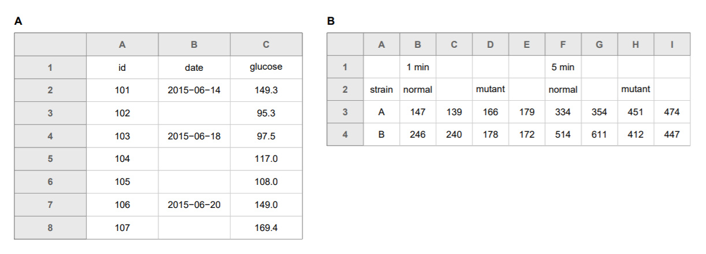
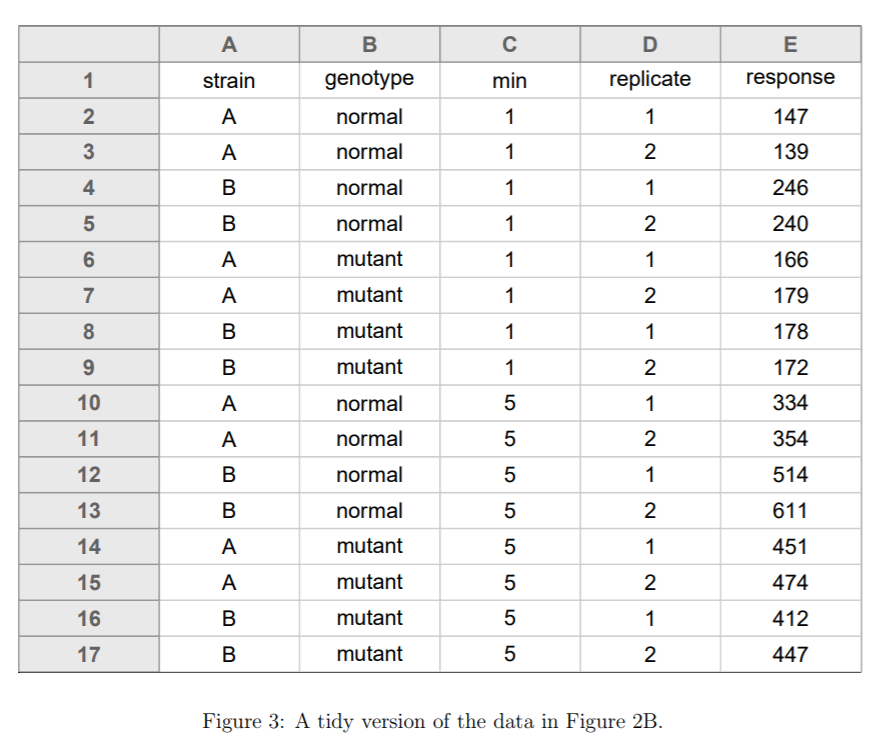

```{r setup, include=FALSE}
options(htmltools.dir.version = FALSE)
library(tidyverse)
```

This presentation is based on:

- [Data Organization in Spreadsheets for Ecologists](https://datacarpentry.org/spreadsheet-ecology-lesson/) from Data Carpentry
- [Data organization in spreadsheets](https://peerj.com/preprints/3183.pdf) by Kara Woo and Karl Broman

---

class: inverse, center, middle

# Spreadsheets $\neq$ lab notebooks

---
# Use the right tool for the job

- data entry: spreadsheet (csv, tsv, xlsx)
- storage: plain text file (csv, tsv, txt)
- metadata: data dictionary (csv, tsv, txt, xlsx)
- cleaning/analysis: code (R, py) _or_ a copy of your raw data with additional steps detailed in a README

---
# Keep raw data raw

Keep data _separate_ from calculations and analyses

If your data organization isn't perfect, that's okay! Make a _copy_ of your data if you want to make changes to avoid contaminating your original data

Adopt the best practices _moving forward_


---
# Organize data as a single rectangle

Separate tables into different sheets _or_ reorganize your data to fit into one rectangle


---
# Create a data dictionary


---

# Missing values

Use `NA`, `NULL`, or even `-` to represent missing values. Avoid numeric values (-999 or 999) and blanks


> _Note:_ `fill()` from the `tidyr` package is a handy function for dealing with blanks in data

---

---

# Don't use formatting to store information

.pull-left[
 
]

.pull-right[

]
---
# Enter ONE piece of information per cell

```{r echo = TRUE}
tibble(species_sex = c("AA-F", "AA-M", "AB-M"),
       tail_length = c("4.4 cm", "43 cm - check??", "6.1 cm"))
```

--

- don't combine information
- don't add units (or use a separate column if needed)
- don't mix data and comments
- avoid mixing English and עברית 

---
# Choose good names

Instead of `Maximum Temp (°C)`, use `max_temp`. Store extra information in a data dictionary

Tip: In R, the `clean_names()` function from the [janitor](https://github.com/sfirke/janitor) package will reformat names for you! 

```{r}
library(tidyverse)
tibble(`Field sites!` = c("A", "B", "B"),
       `Max temp (C)` = c(32, 33, 35)) %>%
    janitor::clean_names()
```

---
# Beware of dates

Excel dates depend on your operating system, Excel version, and locale. 


_Read some horror stories if you need convincing: [1](https://uc3.cdlib.org/2014/04/09/abandon-all-hope-ye-who-enter-dates-in-excel/), [3](http://ecologybits.com/index.php/2016/07/06/beware-this-scary-thing-excel-can-do-to-your-data/), [2](https://practicaldatamanagement.wordpress.com/2014/07/02/dealing-with-dates-as-data-in-excel/)_

--

Best to use one of these options:

- separate into month, date, year columns
- store dates as year, day of year
- store dates as a single string YYYYMMDD
- use underscores

---
# QA your data

Make a **copy** of your data to avoid messing up your real data

Try the [data validation tool](https://support.office.com/en-us/article/apply-data-validation-to-cells-29fecbcc-d1b9-42c1-9d76-eff3ce5f7249?redirectSourcePath=%252fen-us%252farticle%252fApply-data-validation-to-cells-c743a24a-bc48-41f1-bd92-95b6aeeb73c9&ui=en-US&rs=en-US&ad=US) in Excel

---
# Make backups

