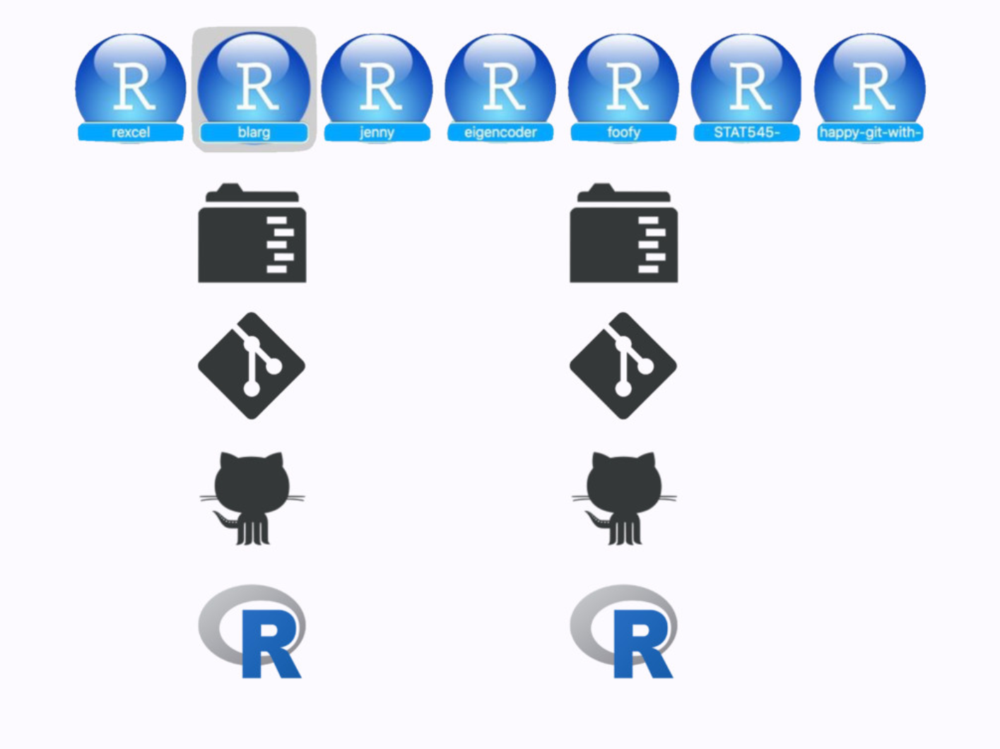
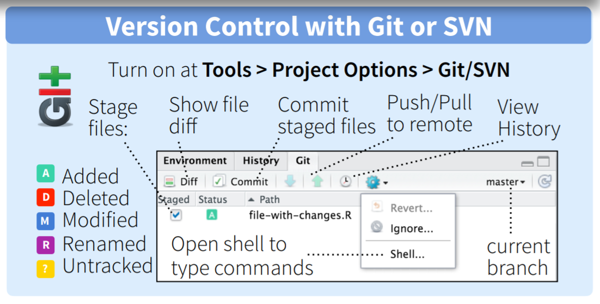

```{r setup, include=FALSE}
options(htmltools.dir.version = FALSE)
library(tidyverse)
library(icon)


 
```
This presentation is based on:

http://ohi-science.org/data-science-training/github.html

---
# Does this look familiar? 

<p align = 'center'>

---

# Why learn and use git/GitHub? 

- Version control
- Easy to share/distribute files (especially code/analyses)
- Files accessible from anywhere with an internet connection
- Improves collaboration

--

_Git enables time travel & alternate realities!_

---
background-image: url(https://media.giphy.com/media/kxAX99ncvbPk4/giphy.gif)
background-position: center
background-size: cover

---
# `r fa_git()`

Version control system that lives on your computer. Think "track changes" for files. ([installation instructions](http://happygitwithr.com/installation-pain.html)) 

--
<p>

---
# GitHub `r fa_github()`

"Dropbox" for git-based projects on the internet. 

- share/store analyses and functions
- browse past versions of code
- browse source code ([CRAN](https://github.com/cran),  [tidyverse](https://github.com/tidyverse/), [rOpenSci](https://github.com/ropensci))
- use packages not on CRAN (`devtools::install_github("account/repo")`)
- host web pages  
--
<br>  
You get unlimited private GitHub repositories for _free_ (normally $7/month) while you are a student! Sign up [here](https://education.github.com/pack).

---
background-image: url(http://ohi-science.org/data-science-training/img/commit_compare_3.png)
background-position: center
background-size: auto 100%

---
# GitHub terminology

- **repository** or repo - project/folder `r fa_folder()`
- **local** - files stored on your computer `r fa_file_code()` `r fa_file_image()` `r fa_file_excel()`
- **remote** - files on github.com `r fa_github()`

---
class: inverse, center, middle

# GitHub: let's get oriented!  
---
background-image: url(img/github-account.png)
background-position: center
background-size: 100%

---
background-image: url(img/github-account.png)
background-position: center
background-size: 100%
---
background-image: url(img/github-copies.png)
background-position: center
background-size: 100%
---
background-image: url(img/github-commits.png)
background-position: center
background-size: 100%
---

# Try this:

1. **Fork a repo** = make a copy of the repo on your account
2. **Make a branch** = start an alternate timeline
3. **Make a change**
4. **Examine the differences**

---

class: inverse, center, middle

# Let's connect to RStudio!

---
class: inverse
background-image: url(http://ohi-science.org/data-science-training/img/clone_step1.png)
background-position: center
background-size: 100%
---
class: inverse
background-image: url(http://ohi-science.org/data-science-training/img/new_project_1.png)
background-position: center
background-size: 100%
---
class: inverse
background-image: url(http://ohi-science.org/data-science-training/img/new_project_2.png)
background-position: center
background-size: 100%
---
class: inverse
background-image: url(http://ohi-science.org/data-science-training/img/new_project_3.png)
background-position: center
background-size: 100%
---
class: inverse
background-image: url(http://ohi-science.org/data-science-training/img/new_project_4.png)
background-position: center
background-size: 100%

---
class: inverse, center, middle

# Inspect your repository

---
class: inverse
background-image: url(http://ohi-science.org/data-science-training/img/RStudio_IDE_git.png)
background-position: center
background-size: 100%

---
You now have a GitHub PROJECT!



https://speakerdeck.com/jennybc/workflow-you-should-have-one

---
class: center, middle

# You can also create a repo from scratch...


---

class: inverse
background-image: url(http://ohi-science.org/data-science-training/img/create_repository_2.png)
background-position: center
background-size: 100%

---
class: inverse, center, middle
# Basic git flow ~ life cycle of a relationship
---
# First, you **pull** them in


---
# Then, you **stage** & **commit**


---
# Finally, you **push** out babies 
## (or **push** them away...)


---
background-image: url(http://ohi-science.org/data-science-training/img/push_pull_clone.png)
background-position: center
background-size: 50%

---
# Sync from RStudio to GitHub




http://www.rstudio.com/wp-content/uploads/2016/01/rstudio-IDE-cheatsheet.pdf

---
background-image:url(https://media.giphy.com/media/ycpCka5zPAUvMr6PU6/giphy.gif), url(http://ohi-science.org/data-science-training/img/pull.png)
background-position: bottom right, center
background-size: 30%, 100%
---
background-image:url(https://media.giphy.com/media/3QAUnTsafSMQE/giphy.gif), url(http://ohi-science.org/data-science-training/img/staged.png)
background-position: bottom right, center
background-size: 30%, 100%
---
background-image:url(https://media.giphy.com/media/3QAUnTsafSMQE/giphy.gif), url(http://ohi-science.org/data-science-training/img/commit.png)
background-position: bottom right, center
background-size: 30%, 100%
---
background-image:url(https://upload.wikimedia.org/wikipedia/commons/f/f1/Egg_laying_-_Harmonia_axyridis_%282127209595%29.jpg), url(http://ohi-science.org/data-science-training/img/push.png)
background-position: bottom right, center
background-size: 30%, 100%
---
class: inverse, center, middle
# Let's collaborate!
---
# Try this!

1. Create a new repository (choose a unique repo name!)
2. In your repo, go into `Settings` --> `Collaborators`.  Add your neighbor as a collaborator

--

Switch over to your _neighbor's_ repo:

1. Accept your neighbor's invitation
2. Create a GitHub RStudio project
3. Make a change
4. Pull + stage/commit + push

---
# There's more!  

...but we'll cover these next time.  In the mean time,  check out these resources for step-by-step guides for:

- dealing with merge conflicts
- collaborating using forks and branches
- burning it all down & starting afresh

http://happygitwithr.com  
http://ohi-science.org/data-science-training/github.html
