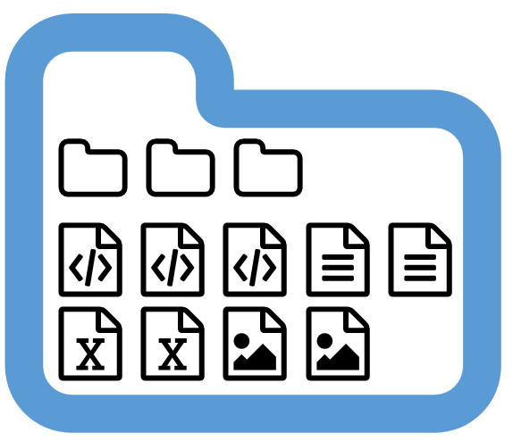

```{r setup, include=FALSE}
options(htmltools.dir.version = FALSE)
library(tidyverse)
library(icon)
```
# `r icon::fa_check()` Check-in

To follow along, you should have:

- a GitHub account - [create one now](https://github.com/) if you don't have one already!
- git installed and connected to RStudio (detailed installation instructions [here](http://happygitwithr.com/installation-pain.html))

Ask questions and share resources on the [EcoDataSci-TLV Slack](https://ecodatascitlv.slack.com/messages)
---
This presentation is based on:

http://ohi-science.org/data-science-training/github.html

& https://nceas.github.io/training-git-intro/getting-started-with-git-rstudio.html

---
background-image: url(http://www.phdcomics.com/comics/archive/phd101212s.gif)
background-position: center
background-size: auto 100%

---

# Why learn and use git/GitHub? 

- Version control
- Easy to share/distribute files, especially code/analyses
- Files accessible from anywhere with an internet connection
- Improves collaboration

--

_Git enables time travel & alternate realities!_

---
background-image: url(https://media.giphy.com/media/kxAX99ncvbPk4/giphy.gif)
background-position: center
background-size: cover

---
# `r fa_git()`

Version control system that lives on your computer. Think "track changes" for files

--
<p>

---
# `r fa_git()` is not

- a full backup
- meant for data, images, etc

git works best with _text-based_ files!

---
# GitHub `r fa_github()`

"Dropbox" for git-based projects on the internet. 

- share/store analyses and functions
- browse past versions of code
- browse source code ([CRAN](https://github.com/cran),  [tidyverse](https://github.com/tidyverse/), [rOpenSci](https://github.com/ropensci))
- use packages not on CRAN (`devtools::install_github("account/repo")`)
- host web pages  

--
<br>  
You get unlimited private GitHub repositories for _free_ (normally $7/month) while you are a student! Sign up [here](https://education.github.com/pack).

---
background-image: url(http://ohi-science.org/data-science-training/img/commit_compare_3.png)
background-position: center
background-size: auto 100%

---
# GitHub terminology

- **repository** or repo - project/folder `r fa_folder()`
- **local** - files stored on your computer `r fa_file_code()` `r fa_file_image()` `r fa_file_excel()`
- **remote** - files on github.com `r fa_github()`

---


class: inverse, center, middle

# GitHub: let's get oriented!  
---
background-image: url(img/github-account.png)
background-position: center
background-size: 100%

---
background-image: url(img/github-account.png)
background-position: center
background-size: 100%
---
background-image: url(img/github-copies.png)
background-position: center
background-size: 100%
---
background-image: url(img/github-commits.png)
background-position: center
background-size: 100%
---
# Let's create a repo from scratch...  
### (choose a unique name!)

.center[

] 

- don't use special characters
- name it `something_meaningful` and not `too-long`
- note for advanced users: R packages cannot take underscores or dashes
---
class: inverse
background-image: url(http://ohi-science.org/data-science-training/img/create_repository_2.png)
background-position: center
background-size: 100%

---

# Alternative workflow

If you want to work off of an existing repository on GitHub...

1. **Fork a repo** = make a copy of the repo on your account
2. **Make a branch** = start an alternate timeline
3. **Make a change**
4. **Examine the differences**

It's good practice to keep your "master" branch clean so that you can keep it synchronized with the original repository

---

class: inverse, center, middle

# Let's connect to RStudio!

---
class: inverse
background-image: url(http://ohi-science.org/data-science-training/img/clone_step1.png)
background-position: center
background-size: 100%
---
class: inverse
background-image: url(http://ohi-science.org/data-science-training/img/new_project_1.png)
background-position: center
background-size: 100%
---
class: inverse
background-image: url(http://ohi-science.org/data-science-training/img/new_project_2.png)
background-position: center
background-size: 100%
---
class: inverse
background-image: url(http://ohi-science.org/data-science-training/img/new_project_3.png)
background-position: center
background-size: 100%
---
class: inverse
background-image: url(https://media.giphy.com/media/vt4gALQsxCDmM/giphy.gif)
background-position: center
background-size: 100%
---
class: inverse
background-image: url(https://media.giphy.com/media/vt4gALQsxCDmM/giphy.gif), url(http://ohi-science.org/data-science-training/img/new_project_4.png)
background-position: bottom right, center
background-size: 30%, 100%

---
class: inverse, center, middle

# Inspect your repository

---
class: inverse
background-image: url(http://ohi-science.org/data-science-training/img/RStudio_IDE_git.png)
background-position: center
background-size: 100%

---
You now have a GitHub PROJECT!


https://speakerdeck.com/jennybc/workflow-you-should-have-one

---
# What's the deal with projects?

Each project is a self-contained set of files. Projects make it **easy to transfer** files to another computer because its **boundaries are clearly defined**

.center[

]
---
# Use relative paths inside projects
 
- looks cleaner
- works for other people/computers

```{r eval = FALSE}
read.csv("data/eilat_survey_2017.csv")
#rather than
read.csv("C:/חזי/phd/thesis/reef_surveys/data/eilat_survey_2017.csv")
```

You never have to use `setwd()` again! 

---
class: inverse, center, middle
# RMarkdown Demo & Exercise
---
class: inverse, center, middle
# Basic git flow ~ life cycle of a relationship
---
# First, you **pull** them in


---
# Then, you **stage** & **commit**


---
# Finally, you **push** out babies 

 

--

## (or **push** them away...) 
---
background-image: url(http://ohi-science.org/data-science-training/img/push_pull_clone.png)
background-position: center
background-size: 50%

---
# Sync from RStudio to GitHub


http://www.rstudio.com/wp-content/uploads/2016/01/rstudio-IDE-cheatsheet.pdf

---
background-image:url(https://media.giphy.com/media/ycpCka5zPAUvMr6PU6/giphy.gif), url(http://ohi-science.org/data-science-training/img/pull.png)
background-position: bottom right, center
background-size: 30%, 100%
---
background-image:url(https://media.giphy.com/media/3QAUnTsafSMQE/giphy.gif), url(http://ohi-science.org/data-science-training/img/staged.png)
background-position: bottom right, center
background-size: 30%, 100%
---
background-image:url(https://media.giphy.com/media/3QAUnTsafSMQE/giphy.gif), url(http://ohi-science.org/data-science-training/img/commit.png)
background-position: bottom right, center
background-size: 30%, 100%
---
background-image:url(https://upload.wikimedia.org/wikipedia/commons/f/f1/Egg_laying_-_Harmonia_axyridis_%282127209595%29.jpg), url(http://ohi-science.org/data-science-training/img/push.png)
background-position: bottom right, center
background-size: 30%, 100%
---
background-image: url(img/github-flow.png)
background-position: center
background-size: 90%
---
class: inverse, center, middle
# Host Rmd's online with GitHub Pages
---
background-image: url(img/github-pages.png)
background-position: center
background-size: 90%

In your repo settings (scroll down):
---
# A few tricks

- Use `index.html` to set a home page for your repo: username.github.io/reponame = username.github.io/reponame/index.html
- use `toc_float` to add a floating table of contents to your RMarkdown webpage (more details [here](https://bookdown.org/yihui/rmarkdown/html-document.html))

```{r eval = FALSE}
---
output:
  html_document:
    toc: true
    toc_float: true
---
```

---
class: inverse, center, middle
# Let's collaborate!
---
# `r icon::fa_check()` Check-in

You should have:
- a repository on GitHub
- an RProject linked to the GitHub repository

---
# Try this!

In your GitHub repo, go into `Settings` --> `Collaborators`.  Add your neighbor as a collaborator


---

# Try this!

Switch over to your _neighbor's_ repo:

1. Accept your neighbor's invitation
2. Create a GitHub RStudio project
3. Make a change
4. Pull + stage/commit + push

---
# There's more!  

...but we'll cover these next time.  In the mean time,  check out these resources for step-by-step guides for:

- using `gitignore` to tell git what NOT to track
- dealing with merge conflicts
- collaborating using forks and branches
- burning it all down & starting afresh

[Happy Git with R](http://happygitwithr.com)  
[NCEAS GitHub crash course](https://nceas.github.io/training-git-intro/getting-started-with-git-rstudio.html)  
[Ocean Health Index GitHub training](http://ohi-science.org/data-science-training/github.html)

